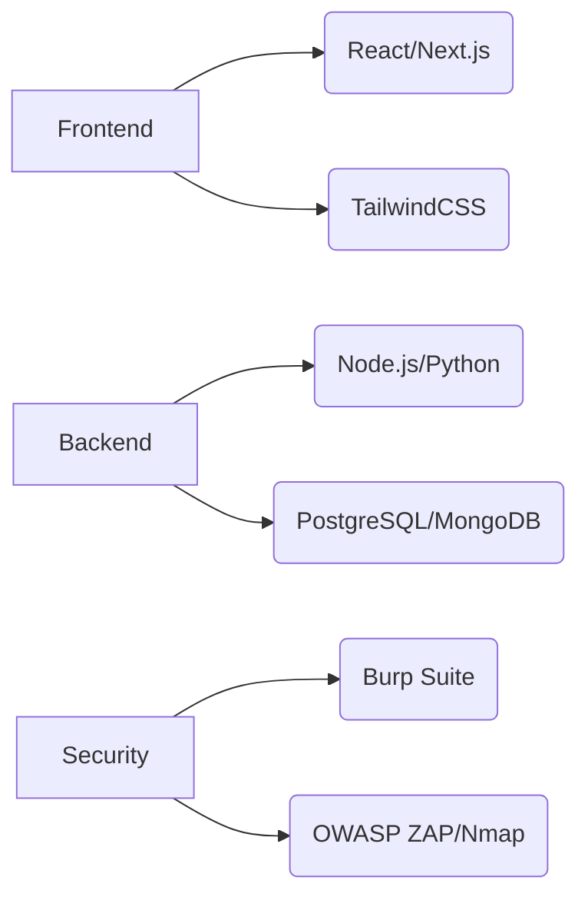

# 🛡️ AppSecWarrior | Cybersecurity Solutions

[](https://github.com/appsecwarrior)
[](https://medium.com/@appsecwarrior)

> *Empowering the next generation of cybersecurity professionals*

## 🌐 About Us
AppSecWarrior is a non-profit organization based in India dedicated to:
- Bridging the cybersecurity skills gap
- Providing accessible security education
- Delivering enterprise-grade security solutions

## 🎯 Our Offerings

### 🆓 Community Services
| Service | Description |
|---------|-------------|
| 📝 Resume Review | Tailored for penetration testing roles |
| 💼 Interview Prep | Technical drills & scenario-based practice |
| 🤝 Job Referrals | Connecting talent with industry opportunities |
| 🎤 Mock Interviews | Full-cycle simulation with feedback |

### 💼 Professional Services
```diff
+ Web App Penetration Testing
+ API Security Assessment
+ Secure Code Review
+ Mobile App Security Testing
+ Threat Modeling & Risk Assessment
+ Cloud Security Audits
```

## 📊 Why Choose Us?
✓ **Expert-Led Guidance** - Seasoned security professionals  
✓ **Practical Approach** - Real-world attack simulations  
✓ **Comprehensive Reports** - Actionable findings with remediation  
✓ **Community Focus** - 50% profits fund free training programs  

## 📬 Get In Touch
🔗 [Website](https://appsecwarrior.org) | 📧 info@appsecwarrior.org  


## 🌟 Featured Content
```markdown
- [X] Beginner's Guide to Penetration Testing
- [X] Common Web App Vulnerabilities Explained
- [ ] CTF Walkthrough Series (Coming Soon)
```

---

<p align="center">
  "Security is not a product, but a process." — Bruce Schneier
</p>

# 🛡️ AppSecWarrior | Cybersecurity & Development Solutions

[](https://github.com/appsecwarrior)
[](https://medium.com/@appsecwarrior)
[](https://appsecwarrior.org)

> *Secure by design, built for performance*

## 🌐 About Us
AppSecWarrior is a non-profit organization based in India specializing in:
- Cybersecurity training & services
- Secure development solutions
- Digital transformation consulting

## 🎯 Core Offerings

### 🆓 Community Services
| Service | Description |
|---------|-------------|
| 📝 Resume Review | Security-focused career guidance |
| 🔐 Interview Prep | Pentest technical drills & scenarios |
| 🤝 Job Referrals | Industry network connections |
| 🎤 Mock Interviews | With senior security engineers |

### 💼 Security Services
```diff
+ Web/Mobile Application Penetration Testing
+ Cloud Security & Architecture Review
+ Threat Modeling & Risk Assessment
+ Compliance Audits (ISO27001, PCI-DSS)
+ Security Awareness Training
```

### 🖥️ Development Services
```python
# Secure Development Solutions
1. UX/UI Design - User-centered secure interfaces
2. Website Development - Jamstack, React, Next.js
3. SEO Optimization - Technical + content strategy
4. Web Application Firewalls - Custom rule sets
5. API Development - REST/GraphQL with OWASP safeguards
```

## 🔍 Why Partner With Us?
| Cybersecurity | Development |
|--------------|-------------|
| ✨ Offensive security experts | ✨ Security-first approach |
| 🛡️ Real-world attack simulations | 🛡️ OWASP compliance built-in |
| 📈 Actionable risk reporting | 📈 Performance optimization |
| 💡 Continuous learning programs | 💡 SEO-optimized architectures |

## 📬 Get In Touch
🔗 [Portfolio](https://appsecwarrior.org/portfolio) | 📧 dev@appsecwarrior.org  
🗓️ [Schedule Call](https://calendly.com/appsecwarrior-consult)

## 🛠️ Tech Stack


---

<p align="center">
  "We don't just build systems secure, we build secure systems."
</p>
